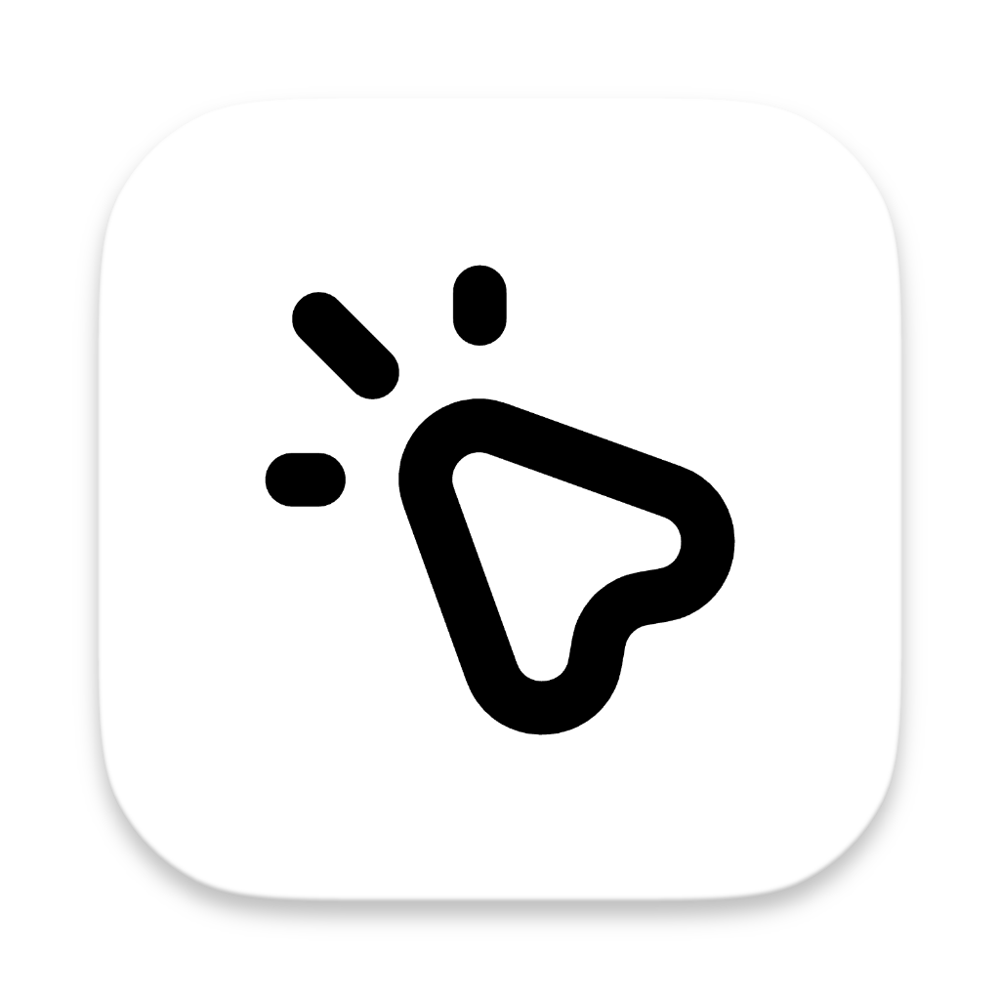
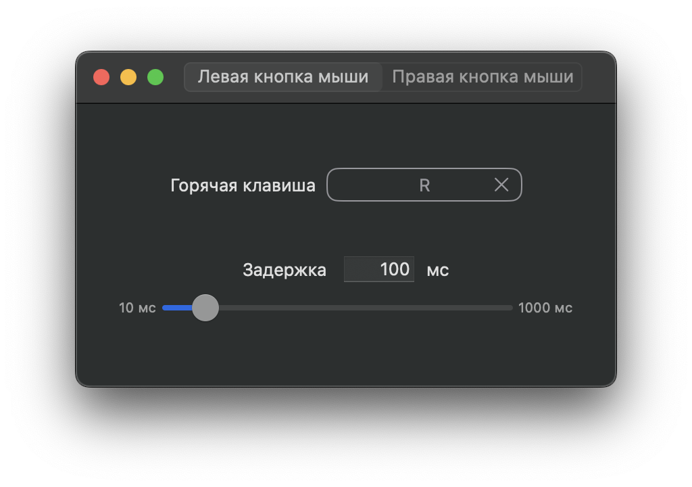

# Clicker

    

---

Автоматизация кликов мыши по нажатию на _Горячую клавишу_. Удобно использовать в **Minecraft**

В отличие от других кликеров, в этом приложении можно назначить кнопки мыши в качестве _Горячих клавиш_, кроме ПКМ и ЛКМ

## TODO: 
* Локализация
* Генерация проекта
* Темы (светлая, тёмная)
